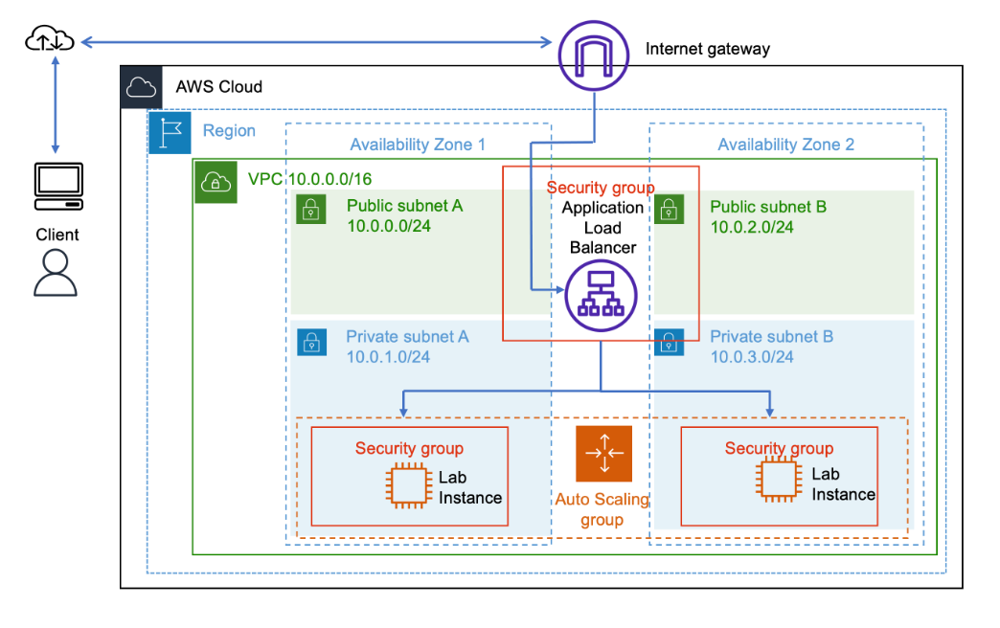
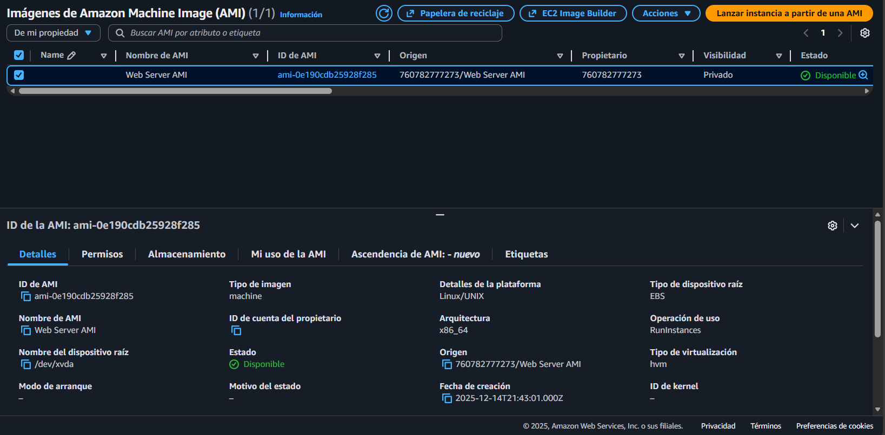
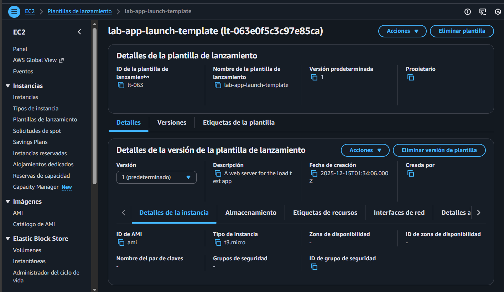
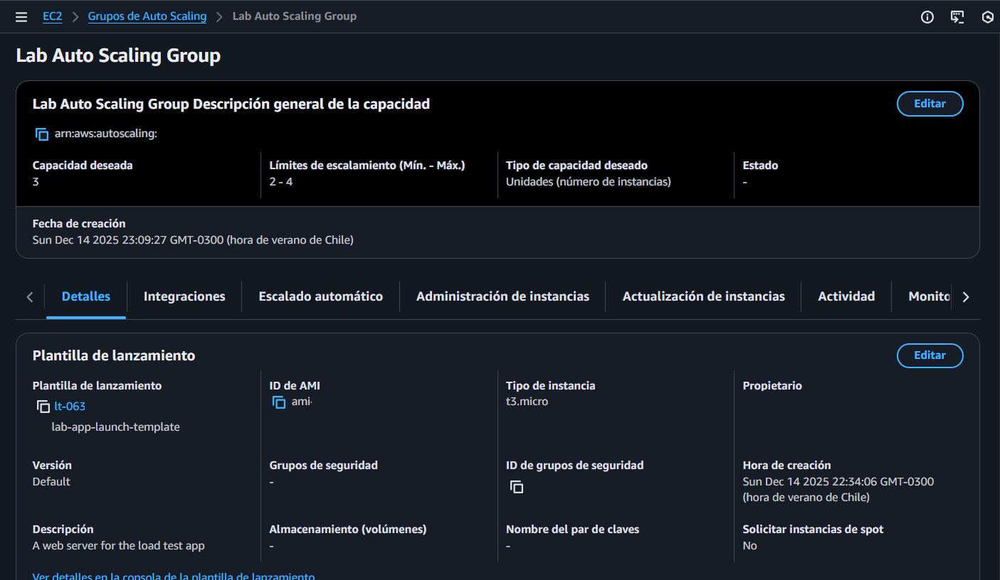
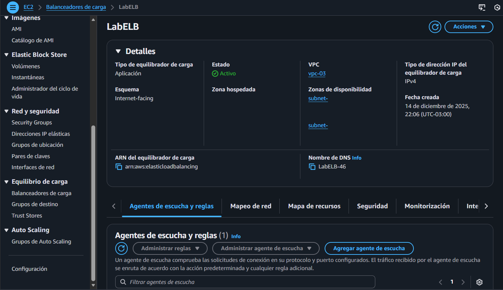
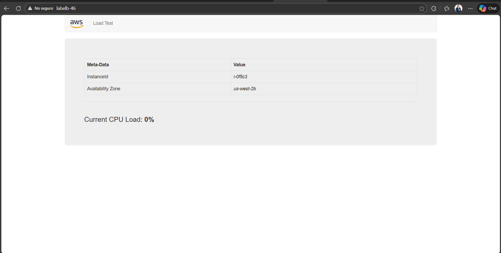
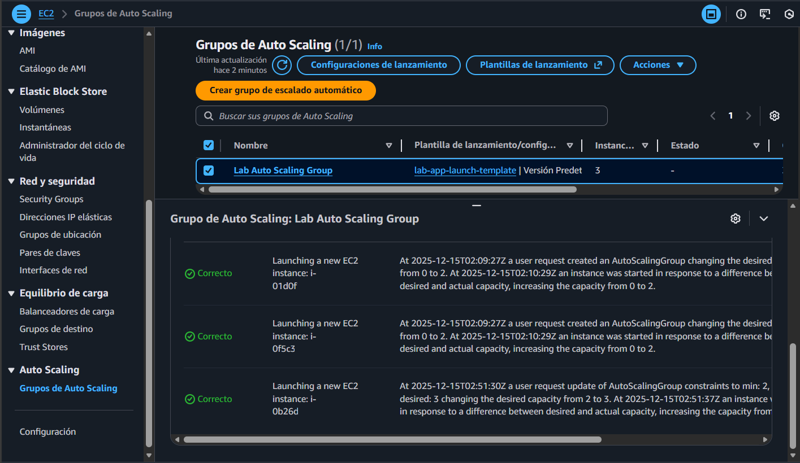
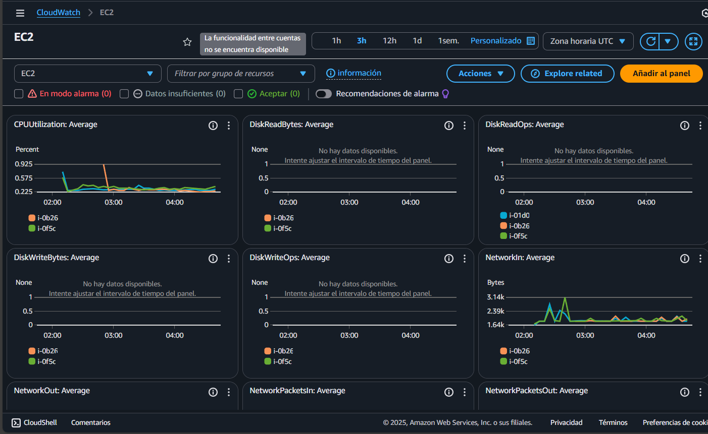

# 🚀 Laboratorio AWS: Auto Scaling + Load Balancer + AMI 

Este proyecto implementa una arquitectura **escalable, altamente disponible y automatizada** en AWS utilizando EC2, AMI personalizada, Launch Template, Auto Scaling Group, Application Load Balancer y monitoreo con CloudWatch.  
Forma parte del programa **AWS re/Start**, demostrando habilidades prácticas en Cloud Computing y DevOps.

---

## 📌 Arquitectura Final



---

## 🛠️ Tecnologías Utilizadas

| Servicio | Función |
|---------|---------|
| 🖥️ **EC2** | Instancias virtuales para la aplicación |
| 📦 **AMI** | Imagen personalizada para escalar instancias |
| 📝 **Launch Template** | Configuración base del Auto Scaling Group |
| 📈 **Auto Scaling Group** | Escalado automático según demanda |
| 🌐 **Application Load Balancer** | Distribución de tráfico entre instancias |
| 📊 **CloudWatch** | Métricas, alarmas y monitoreo |

---

## 🧩 Tareas del Laboratorio

### **1️⃣ Crear instancia base (Web Server)**  
Para iniciar la arquitectura, se lanzó una **instancia EC2 en una subred pública**, permitiendo acceso desde Internet para instalar y probar la aplicación.

En esta instancia se realizó:

- Instalación del servidor web **Apache**
- Configuración de la aplicación base
- Prueba de funcionamiento accediendo desde el navegador mediante la **IP pública**

Esta instancia servirá como **modelo inicial** para crear la AMI personalizada que utilizará el Auto Scaling Group.

📷 *La instancia fue verificada correctamente desde el navegador, mostrando la aplicación web en funcionamiento.*

---

### **2️⃣ Crear AMI personalizada desde la instancia Web Server**

Con la instancia base funcionando correctamente, se creó una **AMI personalizada** que captura el estado completo del servidor, incluyendo:

- Sistema operativo  
- Apache instalado y configurado  
- Archivos de la aplicación  
- Ajustes realizados durante la preparación  

Esta AMI permite que el **Auto Scaling Group** lance nuevas instancias idénticas sin necesidad de configuraciones manuales, garantizando:

- **Consistencia** entre todas las instancias  
- **Rápido despliegue** al escalar  
- **Menor riesgo de errores** por configuraciones repetidas  

Pasos realizados:

- Crear imagen desde la instancia base  
- Esperar a que la AMI cambie a estado **available**

### 📷 Captura de la AMI



---

### **3️⃣ Crear Launch Template**  
- Seleccionar AMI personalizada creada previamente  
- Configurar tipo de instancia `t3.micro`  
- Asignar grupo de seguridad `HTTPAccess`  
- Sin IP pública (instancias en subred privada)

### 📷 Captura del Launch Template

El Launch Template define la configuración base que utilizarán las instancias EC2 dentro del Auto Scaling Group.  
En este caso, se seleccionó la **AMI personalizada WebServerAMI**, se configuró el tipo de instancia `t3.micro`, se asignó el grupo de seguridad `HTTPAccess` y se dejó sin par de claves, tal como indica el laboratorio.  
La plantilla está diseñada para ejecutarse en **subredes privadas sin IP pública**, reforzando la seguridad de la arquitectura.



---

### **4️⃣ Crear Auto Scaling Group (ASG)**  
- Subredes privadas  
- Capacidad: min 2, max 4  
- Política de escalado: CPU > 50%  
- Asociar al Target Group existente  

### 📷 Captura del Auto Scaling Group (ASG)

El Auto Scaling Group se configuró utilizando la AMI personalizada y el Launch Template creado previamente.  
Se seleccionaron **subredes privadas** en dos zonas de disponibilidad para asegurar alta disponibilidad, y se definió un tamaño de grupo con **capacidad mínima de 2**, **máxima de 4** y **capacidad deseada de 2** instancias.  

El ASG se asoció al **Target Group `webserver-app`**, permitiendo que el Application Load Balancer distribuya el tráfico entre las instancias.  
Además, se configuró una **política de escalado basada en la utilización promedio de CPU**, con un objetivo del **50%**, lo que permite que el grupo aumente o reduzca la capacidad automáticamente según la carga.


---

### **5️⃣ Crear Application Load Balancer (ALB)**  
- Subredes públicas en dos zonas de disponibilidad  
- Grupo de seguridad `HTTPAccess` con puerto 80 habilitado  
- Crear Target Group `lab-target-group`  
- Asociar instancias del Auto Scaling Group

### 📷 Captura del ALB y Target Group

Se creó un **Application Load Balancer (ALB)** llamado `LabELB`, configurado como **Internet-facing** para distribuir tráfico HTTP entre las instancias EC2.  
Se asignaron **subredes públicas** en dos zonas de disponibilidad y se aplicó el **grupo de seguridad `HTTPAccess`**, que permite el tráfico entrante por el puerto 80.

El ALB incluye un **listener en el puerto HTTP:80**, cuya acción predeterminada es **reenviar las solicitudes al Target Group `lab-target-group`**.  
Este grupo está vinculado a las instancias del Auto Scaling Group y utiliza una **comprobación de estado en la ruta `/index.php`** para verificar la disponibilidad de las instancias.



---

### **6️⃣ Probar acceso desde Load Balancer**  
- Abrir el DNS público del ALB  
- Verificar que la aplicación web responde correctamente  
- Confirmar que se muestra el InstanceId, zona de disponibilidad y carga de CPU

### 📷 Captura de la aplicación web funcionando

Se accedió al **DNS público del Application Load Balancer (ALB)** para verificar que la aplicación web está activa y responde correctamente.  
La página muestra información en tiempo real de la instancia EC2 que atendió la solicitud, incluyendo:

- **InstanceId** (parcialmente oculto por privacidad)  
- **Zona de disponibilidad** (`us-west-2b`)  
- **Carga actual de CPU** (`0%`)

Esta validación confirma que el balanceador de carga está funcionando correctamente y que las instancias del Auto Scaling Group están activas y saludables.




---

### **7️⃣ Probar escalado automático**  
- Generar tráfico desde la aplicación web  
- Supervisar la métrica de CPU en CloudWatch  
- Ver cómo el Auto Scaling Group lanza nuevas instancias  
- Confirmar que reduce la capacidad cuando baja la carga

### 📷 Captura del escalado automático en acción

Para probar el escalado automático, se accedió a la aplicación web mediante el DNS del Load Balancer y se activó la opción **Start Stress**, lo que provocó un aumento en la utilización de CPU.  
Amazon CloudWatch detectó que la métrica superó el umbral del **50%**, activando la política de escalado configurada en el Auto Scaling Group.

Como resultado, el grupo lanzó **una nueva instancia EC2**, aumentando la capacidad de 2 a 3 instancias activas.  
Esta captura muestra la actividad del grupo, incluyendo los eventos de escalado y los identificadores de las instancias (parcialmente ocultos por privacidad).




---

### **📊 CloudWatch en acción**  
CloudWatch se activó automáticamente para supervisar el rendimiento de las instancias EC2 del Auto Scaling Group.

- **Métrica supervisada**: `CPUUtilization`  
- **Alarma configurada**: CPU > 50%  
- **Acción automática**: escalar instancias EC2

### 📷 Captura de alarmas en CloudWatch

La siguiente captura muestra cómo CloudWatch monitorea en tiempo real el uso de CPU de las instancias EC2.  
Cuando la métrica supera el umbral del **50%**, se activa una alarma que desencadena la política de escalado configurada en el Auto Scaling Group.  
Esto permite aumentar la capacidad automáticamente para mantener el rendimiento de la aplicación.




---

## ✅ Conclusiones

Este laboratorio permitió implementar una arquitectura escalable y altamente disponible en AWS, utilizando componentes clave de infraestructura como EC2, AMI personalizada, Auto Scaling y Load Balancer.

✔ Se creó una **AMI personalizada** a partir de una instancia EC2 configurada con una aplicación web  
✔ Se configuró un **Auto Scaling Group** con políticas de escalado dinámico basadas en métricas de CPU  
✔ Se implementó un **Application Load Balancer (ALB)** para distribuir tráfico entre instancias en múltiples zonas de disponibilidad  
✔ Se probó el **escalado automático**, verificando el aumento de capacidad ante carga elevada  
✔ Se utilizó **Amazon CloudWatch** para monitorear métricas en tiempo real y activar alarmas de escalado  
✔ La infraestructura quedó **lista para producción**, con alta disponibilidad, escalabilidad automática y monitoreo integrado


---

## 🧠 Aprendizajes Clave

- Diseño de **arquitecturas escalables y tolerantes a fallos** utilizando Auto Scaling y balanceo de carga  
- Implementación de **subredes públicas y privadas** para separar componentes expuestos de recursos internos  
- Aplicación de **buenas prácticas de seguridad en AWS**, incluyendo grupos de seguridad y aislamiento de red  
- **Integración de servicios** como EC2, AMI, ALB Application Load Balancer, Auto Scaling y CloudWatch para construir soluciones completas  
- **Diagnóstico y resolución de problemas** durante la creación, despliegue y monitoreo de la infraestructura  
- Elaboración de **documentación técnica profesional**, ideal para portafolios y entrevistas técnicas  


---

## 📁 Estructura del repositorio

```
## 📁 Estructura del repositorio

📦 AWS-LAB-AUTO-SCALING-LOAD-BALANCER-Y-AMI
├── 📂 Screenshots
│   ├── 🖼️ ami.png
│   ├── 🖼️ Arquitectura.png
│   ├── 🖼️ AutoScalingActivity.png
│   ├── 🖼️ AutoScalingGroup.png
│   ├── 🖼️ CloudWatchAlarma.png
│   ├── 🖼️ LaunchTemplate.png
│   ├── 🖼️ LoadBalancer.png
│   └── 🖼️ WebApp.png
│
└── 📄 README.m
```


